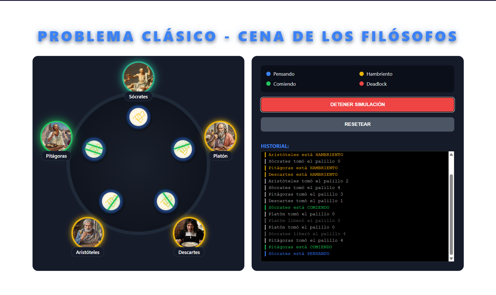

# Dining Philosophers Problem Simulator 🥢

[🇺🇸 English](README.md) | [🇪🇸 Español](README_es.md)

A graphical, real-time simulation of the classic **Dining Philosophers Problem**, built with **Go** and **Wails v2** (Vanilla JS + Vite).

 *(Preview placeholder)*

## 🧠 The Problem

The Dining Philosophers problem is a classic computer science problem designed by Edsger Dijkstra to illustrate synchronization issues and techniques for resolving them in concurrent algorithm design.

**The Scenario:**
Five philosophers sit around a circular table. In front of each philosopher is a plate of spaghetti. Between each pair of plates is a single chopstick.
A philosopher must have **two chopsticks** to eat (the one to their left, and the one to their right). 
Since there are only 5 chopsticks total, they must share them. The philosophers alternate between three states:
1. **Thinking** 🔵
2. **Hungry** 🟡 (Waiting to acquire both adjacent chopsticks)
3. **Eating** 🟢 (Holding both chopsticks)

**The Challenge:**
If every philosopher picks up their right chopstick at the exact same time, they will all be stuck waiting for the left chopstick forever. This is called a **Deadlock**.

**The Solution Implemented:**
This simulator prevents deadlocks using a **Resource Hierarchy Solution**. Each chopstick is assigned an ID (0 to 4). Philosophers are instructed to always pick up the chopstick with the *lower* ID first, and the higher ID second. This breaks the circular wait condition and guarantees that at least one philosopher can eat at any given time.

---

## 🛠️ Prerequisites

Before you can run or compile this project, ensure you have the following installed:
- [Go](https://go.dev/doc/install) (version 1.18 or higher recommended)
- [Node.js and npm](https://nodejs.org/) (for the Vite frontend)
- [Wails CLI v2](https://wails.io/docs/gettingstarted/installation)

You can install the Wails CLI by running:
```bash
go install github.com/wailsapp/wails/v2/cmd/wails@latest
```

---

## 🚀 How to Run the Simulator (Development Mode)

1. **Clone or open** the repository in your terminal.
2. **Add Philosopher Images:**
   The UI expects historical portraits of the philosophers. You must place them in the following directory:
   `frontend/src/assets/images/`
   
   The required filenames are:
   - `socrates_thinking.png`, `socrates_hungry.png`, `socrates_eating.png`
   - `platon_thinking.png`, `platon_hungry.png`, `platon_eating.png`
   - `descartes_thinking.png`, `descartes_hungry.png`, `descartes_eating.png`
   - `aristoteles_thinking.png`, `aristoteles_hungry.png`, `aristoteles_eating.png`
   - `pitagoras_thinking.png`, `pitagoras_hungry.png`, `pitagoras_eating.png`
   *(If an image is missing, a default gray avatar will be used).*

3. **Start the development server:**
   Run the following command in the root of the project:
   ```bash
   wails dev
   ```
   This will start the backend Go process and a hot-reloading frontend.

---

## 📦 How to Compile (Production)

To build a standalone executable that you can share or run without a terminal:

1. Open your terminal in the project root directory.
2. Run the build command:
   ```bash
   wails build
   ```
3. Once completed, your executable will be located in the `build/bin/` directory (e.g., `sistemas-operativos.exe` on Windows). You can simply double-click it to run the simulator!

---

## 🖥️ Technology Stack
- **Backend:** Go (Goroutines, Mutexes, Channels)
- **Frontend:** HTML, CSS, Vanilla JavaScript
- **Framework:** Wails v2, Vite
